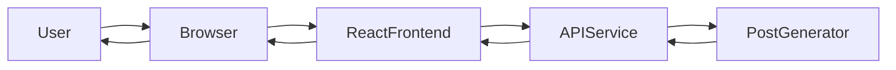
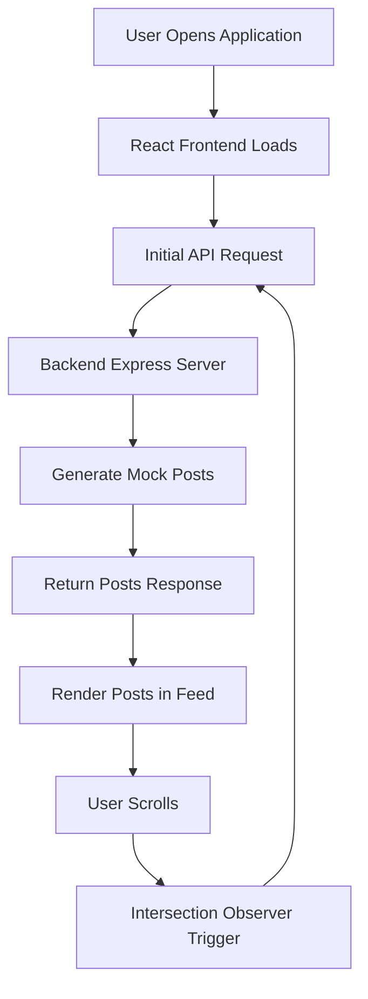
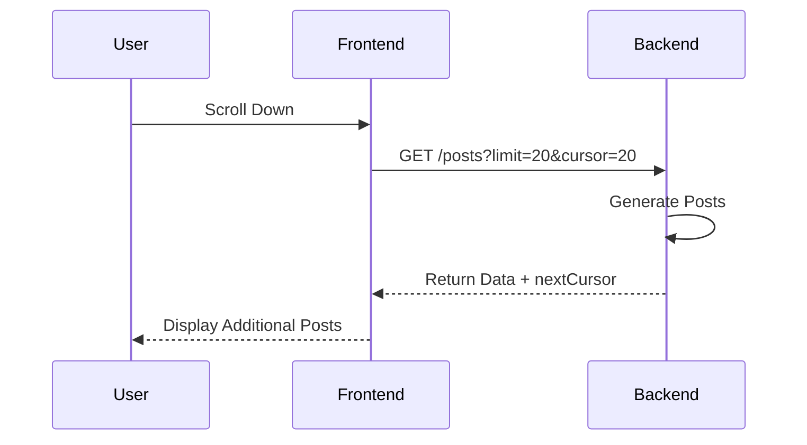
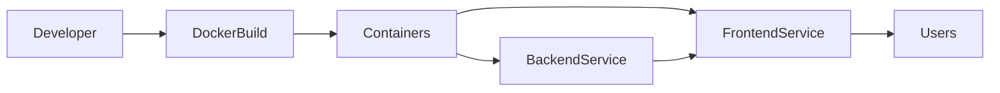
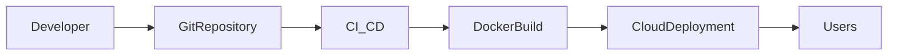

# Infinite Feed Web Application

A scalable **Infinite Scroll Feed Web Application** built using **React (Vite), TailwindCSS, Node.js (Express), and Docker**.  
The application demonstrates how modern social media platforms efficiently load large datasets using **cursor-based pagination and lazy loading**.

The backend dynamically generates **up to 1,000,000 posts** while maintaining high performance and smooth scrolling.

---

# Project Overview

Modern platforms like **Instagram, Twitter, and LinkedIn** use infinite scrolling to continuously load new content as the user scrolls. This project replicates that architecture using a lightweight API and optimized frontend rendering.

The system focuses on:

- Efficient infinite scrolling
- Cursor-based pagination
- Scalable API design
- Dockerized full-stack deployment
- Smooth frontend performance

---

# Features

- Infinite scrolling feed
- Cursor-based pagination API
- Handles up to **1,000,000 posts**
- Responsive UI using TailwindCSS
- Dockerized frontend and backend
- Health check API
- Lazy loading of content
- Efficient rendering strategy

---

# Tech Stack

## Frontend
- React (Vite)
- TypeScript
- TailwindCSS
- Shadcn UI
- IntersectionObserver API

## Backend
- Node.js
- Express.js
- CORS Middleware

## DevOps
- Docker
- Docker Compose

---

# System Architecture



---

# Application Workflow



---

# Cursor Pagination Flow



---

# Folder Structure

```
infinite-feed
│
├── api
│   ├── server.js
│   ├── package.json
│   └── Dockerfile
│
├── src
│   ├── components
│   ├── App.tsx
│   ├── main.tsx
│   └── index.css
│
├── public
│
├── Dockerfile
├── docker-compose.yml
├── package.json
└── README.md
```

---

# Backend API

The backend implements a **cursor-based pagination API** that returns posts dynamically.

Instead of page numbers, the client sends a **cursor value** representing the last fetched post index.

---

# Health Check Endpoint

```
GET /health
```

Response

```
OK
```

Example

```
http://localhost:8080/health
```

---

# Fetch Posts API

```
GET /posts?limit=20&cursor=0
```

Parameters

| Parameter | Description |
|-----------|-------------|
| limit | Number of posts to fetch |
| cursor | Starting position |

Example Request

```
http://localhost:8080/posts?limit=10&cursor=20
```

Example Response

```json
{
  "data": [
    {
      "id": 21,
      "author": "User 21",
      "content": "This is post number 21"
    }
  ],
  "nextCursor": 30
}
```

---

# Infinite Scroll Logic

The frontend uses the **IntersectionObserver API** to detect when the user reaches the bottom of the feed.

Process:

1. User scrolls down
2. IntersectionObserver detects viewport intersection
3. Frontend calls `/posts` API
4. Backend returns new posts
5. Feed dynamically updates

This approach ensures:

- minimal API calls
- smooth UI performance
- scalable content loading

---

# Docker Architecture



---

# Running the Application

## Prerequisites

- Node.js
- Docker
- Docker Compose

---

# Run Using Docker

Build and start containers

```bash
docker compose up --build
```

---

# Access the Application

Frontend

```
http://localhost:3000
```

Backend

```
http://localhost:8080
```

Health Check

```
http://localhost:8080/health
```

---

# Performance Strategy

The application maintains high performance using the following techniques:

### Lazy Loading
Posts are loaded only when the user scrolls near the bottom.

### Cursor Pagination
Avoids database offset queries and improves scalability.

### Dynamic Post Generation
Posts are generated in memory instead of storing millions of records.

### Efficient Rendering
Frontend renders only visible content to maintain smooth scrolling.

---

# Possible Future Enhancements

- Integrate real database (PostgreSQL / MongoDB)
- Implement caching using Redis
- Add authentication and user sessions
- Add media content support
- Implement feed virtualization
- Add rate limiting and API security

---

# Deployment Strategy



---

# Key Learning Outcomes

This project demonstrates:

- Infinite scroll implementation
- Cursor-based pagination
- Efficient API design
- Dockerizing full-stack applications
- Building scalable frontend architectures
- Handling large datasets efficiently

---

# Author

Vinay Nethala  
Frontend Developer
